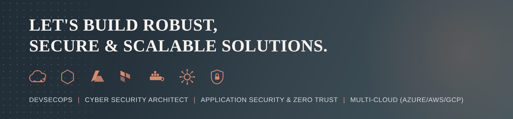

<!--
  ════════════════════════════════════════════════════════════════════════
  PROFILE README — repo: devsecforge/devsecforge
  Cybersecurity • Cloud • DevSecOps • AI Security & Privacy • Governance
  Stats widgets pull LIVE data from GitHub.
  ════════════════════════════════════════════════════════════════════════
-->

<!-- ░░░░░░░░░░░░░░░░░░░░ HERO BANNER ░░░░░░░░░░░░░░░░░░░░ -->
<a href="https://github.com/devsecforge">
    </a>

<div align="center">

<!-- ELITE CREDENTIAL LINE -->


<!-- TYPING ANIMATION -->
[](https://www.linkedin.com/in/naz-cyber-solutions)

<a href="https://www.linkedin.com/in/naz-cyber-solutions"></a>
<a href="mailto:snaz2004@yahoo.com"></a>


</div>

<!-- ░░░░░░░░░░░░░░░░░░░░ NAV BAR ░░░░░░░░░░░░░░░░░░░░ -->
<p align="center">
  <a href="#about"></a>
  <a href="#certs"></a>
  <a href="#stack"></a>
  <a href="#projects"></a>
  <a href="#ai"></a>
  <a href="#writing"></a>
  <a href="#contact"></a>
</p>

---

<a id="about"></a>


### **Building secure, intelligent platforms for the future**

***Technology never stands still. My mission is to make sure security keeps pace with innovation.***

I help organizations design, build, and operate digital platforms that are secure, resilient, and ready for the future. My work brings together cybersecurity, cloud computing, artificial intelligence, platform engineering, infrastructure, networking, and automation, so security becomes part of every decision instead of an afterthought.

I believe great technology is built on strong architecture, intelligent automation, and continuous improvement. Whether I'm designing cloud platforms, securing artificial intelligence, improving engineering practices, or modernizing enterprise infrastructure, my goal stays the same: deliver solutions that protect people, support business growth, and inspire confidence.

**What I focus on**

- Building secure cloud platforms
- Protecting artificial intelligence systems
- Creating modern engineering practices
- Automating security and operations
- Designing resilient enterprise architecture
- Strengthening security operations
- Developing zero trust strategies
- Enabling secure innovation

**My approach**

  ```
  Secure by Design
  Automate by Default
  Trust Nothing, Verify Everything
  Build for the Future
  ```

  *Security should never slow innovation. It should make innovation possible.*

---

## 🎯 Focus Areas

> 
> 24/7 SOC leadership · Incident Response & Forensics · Threat Hunting (ATT&CK) · Detection Engineering · SIEM / XDR / SOAR
>
>> 
>> Azure · AWS · GCP · Secure landing zones · CSPM & posture management · Identity & Zero Trust · Encryption & KMS
>>
>>> 
>>> Secure CI/CD gates · IaC & container security · SAST · SCA · DAST · Policy-as-code · Security automation
>>>
>>>> 
>>>> LLM / ML security · AI governance · Data privacy & DLP · Model risk & red-teaming · Responsible AI

---

<a id="ai"></a>
## 🤖 AI Security & Privacy

> Securing AI is the defining security challenge of this decade. I focus on governing and hardening AI/ML systems and protecting the data that powers them — mapping emerging AI risk to the frameworks below.

<div align="center">


</div>

| Domain | What I Cover |
|---|---|
| 🧠 **LLM / ML Security** | Prompt injection, jailbreaks, insecure output handling, model/data poisoning, supply-chain risk — mapped to **OWASP LLM Top 10** & **MITRE ATLAS** |
| 🏛️ **AI Governance** | AI risk management & assurance aligned to **NIST AI RMF** and **ISO/IEC 42001** — model inventories, approval gates, accountability frameworks |
| 🔏 **Data Privacy** | Data classification, DLP, minimization, and privacy-by-design under **GDPR / PIPEDA**; securing training & inference data end-to-end |
| ⚙️ **Secure AI in CI/CD** | Guardrails, secrets hygiene, and provenance for model & dependency pipelines — security gates baked into MLOps |
| 🤖 **Agentic AI Security** <sub>·trending</sub> | Threat modeling for autonomous AI agents — tool-scoping, sandboxing, permission boundaries, and agent-to-agent trust |
| 🎯 **AI Red-Teaming & Adversarial Testing** <sub>·trending</sub> | Structured adversarial testing of models & pipelines against **MITRE ATLAS** and **OWASP LLM** attack techniques |
| ☁️ **Cloud AI Workload Security** | Securing Azure AI, AWS Bedrock & GCP Vertex AI workloads — identity, network isolation, and data-boundary controls |
| 🧭 **Responsible & Ethical AI** | Bias, fairness, and transparency reviews woven into the model lifecycle and governance gates |
| 🔗 **Third-Party AI & Vendor Risk** | Due diligence and continuous risk assessment for third-party models, APIs, and AI vendors |

---

<a id="certs"></a>
## 🎓 Certifications

<div align="center">

**🔐 Security Leadership & Governance**


**☁️ Cloud — AWS & Azure**


**🪟 Microsoft & Foundations**


**🎯 AI & Emerging — _On My Roadmap_** <sub>(targeting / in progress)</sub>


**🎓 Education**


</div>

---

<a id="stack"></a>
## 🧰 Technical Arsenal

**🧩 Core Skills**
<br>


**🛰️ SIEM · XDR · SOAR**
<br>


**☁️ Cloud Security — Azure · AWS · GCP**
<br>

&nbsp;


**🔑 Identity & Zero Trust**
<br>


**⚙️ DevSecOps · IaC · Automation**
<br>

&nbsp;


**🐧 Operating Systems**
<br>

&nbsp;


**🔀 Version Control & CI/CD Pipeline**
<br>


**☁️ Cloud Technologies — AWS**
<br>


**📝 Scripting & Programming Languages**
<br>

&nbsp;


**🗄️ Web & Database Management**
<br>


**📡 Monitoring Tools**
<br>


**🤖 AI Security · Data**
<br>


**📋 Governance & Frameworks**
<br>


<br>

**🗂️ Everything at a Glance**

<div align="center">

</div>

---

<a id="projects"></a>
## 🚀 Featured Work

> over a decade and a half distilled into open reference material — architecture, detection, response, governance & AI security — plus hands-on DevSecOps labs. **13 focused repositories, one coherent security program.**

<div align="center">
<a href="https://github.com/devsecforge/zero-trust-reference-architecture"></a>
<a href="https://github.com/devsecforge/soc-detection-engineering"></a>
<a href="https://github.com/devsecforge/ai-security-lab"></a>
</div>

🏛️ 
- 🛡️ **[zero-trust-reference-architecture](https://github.com/devsecforge/zero-trust-reference-architecture)** — NIST 800-207 principles, maturity model, ISO/CIS control mappings, Azure/AWS enforcement.
- ☁️ **[cloud-security-baseline](https://github.com/devsecforge/cloud-security-baseline)** — Azure Policy + AWS Terraform guardrails mapped to CIS / NIST CSF, with a CSPM operating model.

🎯 
- 🎯 **[soc-detection-engineering](https://github.com/devsecforge/soc-detection-engineering)** — Sentinel KQL + Splunk detections mapped to MITRE ATT&CK.
- 🚨 **[incident-response-playbooks](https://github.com/devsecforge/incident-response-playbooks)** — NIST 800-61 IR playbooks, tabletop exercises & report templates.
- 📊 **[security-metrics-dashboard](https://github.com/devsecforge/security-metrics-dashboard)** — SOC / exec / DORA metrics catalog, KQL, and board-ready reporting.

📜 
- 📜 **[compliance-as-code](https://github.com/devsecforge/compliance-as-code)** — ISO 27001 / NIST CSF / CIS crosswalk + OPA & Azure Policy enforcement + continuous-evidence model.
- 🔏 **[privacy-skills](https://github.com/devsecforge/privacy-skills)** — structured privacy & data-protection skills mapped to GDPR · CCPA · PIPEDA · EU AI Act · HIPAA · LGPD · PIPL · DPDP.

🤖 
- 🤖 **[ai-security-lab](https://github.com/devsecforge/ai-security-lab)** — OWASP LLM Top 10, prompt-injection guardrails, STRIDE-for-AI threat model, NIST AI RMF / ISO 42001.
- 🧠 **[agent-security-skills](https://github.com/devsecforge/agent-security-skills)** — framework-mapped defensive security skills for AI agents (MITRE ATT&CK · NIST CSF · D3FEND · NIST AI RMF), schema-validated in CI.

🧪  <sub>building in public</sub>
- 🛡️ **[security-operations-toolkit](https://github.com/devsecforge/security-operations-toolkit)** — CI/CD security gate: secret, SAST, SCA, IaC & container scanning.
- ☸️ **[kubernetes-security-lab](https://github.com/devsecforge/kubernetes-security-lab)** — 5-layer defense-in-depth: Pod Security Admission, RBAC, NetworkPolicy, Falco.
- 🔐 **[secure-terraform-aws](https://github.com/devsecforge/secure-terraform-aws)** — Secure-by-default AWS: hardened S3/KMS, least-privilege IAM, tfsec + checkov.
- 🛰️ **[security-intel-mcp](https://github.com/devsecforge/security-intel-mcp)** — MCP server giving AI assistants CVE (NVD), EPSS & CISA KEV intelligence with combined risk enrichment.

---

<a id="writing"></a>
## ✍️ Writing & Thought Leadership

> 24 articles on practical security, cloud & AI — for engineers and leaders. Full archive → [`articles/`](https://github.com/devsecforge/devsecforge/tree/main/articles) · cross-posted on <a href="https://www.linkedin.com/in/naz-cyber-solutions">LinkedIn</a>

<details>
<summary><b>🛡️ Cybersecurity, SOC & Zero Trust</b> — 5 articles</summary>
<br>

- 🔐 [Zero Trust in Practice](articles/zero-trust-in-practice.md) — turning NIST 800-207 into Conditional Access & least-privilege that actually ship
- 🎯 [Detection Engineering That Works](articles/detection-engineering-that-works.md) — high-fidelity Sentinel/Splunk rules mapped to MITRE ATT&CK, not alert noise
- 📐 [Detection Engineering with Sigma Rules](articles/detection-engineering-with-sigma-rules.md) — vendor-agnostic threat detection you can port across SIEMs
- 🪪 [Identity Is the New Perimeter](articles/identity-is-the-new-perimeter.md) — lessons from a decade of IAM breaches
- 🧯 [Ransomware Resilience](articles/ransomware-resilience.md) — building an incident response plan that actually works under pressure

</details>

<details>
<summary><b>☁️ Cloud & Infrastructure Security</b> — 2 articles</summary>
<br>

- ☁️ *Cloud security baselines — policy-as-code guardrails for Azure & AWS* &nbsp;`(coming soon)`
- 🌐 [CSPM in a Multi-Cloud World](articles/cspm-in-a-multi-cloud-world.md) — one posture-management operating model across Azure, AWS & GCP

</details>

<details>
<summary><b>🤖 AI & LLM Security</b> — 7 articles</summary>
<br>

- 🤖 [Securing AI: A Leader's Field Guide](articles/securing-ai-a-leaders-guide.md) — OWASP LLM Top 10, NIST AI RMF & ISO 42001, privacy-by-design
- 🕹️ [Agentic AI Security](articles/agentic-ai-security.md) — threat-modeling autonomous agents before they run wild
- 📋 [The OWASP LLM Top 10, Explained](articles/owasp-llm-top-10-explained.md) — for security leaders, not just ML engineers
- 💉 [Prompt Injection 101](articles/prompt-injection-101.md) — the new SQL injection, and how to defend against it
- 🔍 [Securing RAG Pipelines](articles/securing-rag-pipelines.md) — data leakage risks in retrieval-augmented generation
- 🧪 [Red-Teaming LLMs](articles/red-teaming-llms.md) — a practical playbook using MITRE ATLAS
- 🛡️ [Zero Trust for AI Workloads](articles/zero-trust-for-ai-workloads.md) — extending ZTA principles to model endpoints

</details>

<details>
<summary><b>📜 Governance, Privacy & Compliance</b> — 6 articles</summary>
<br>

- 🧾 [Building an AI-BOM](articles/building-an-ai-bom.md) — model supply-chain visibility for security teams
- 🗓️ [NIST AI RMF in Practice](articles/nist-ai-rmf-in-practice.md) — a 90-day implementation plan
- ⚖️ [ISO/IEC 42001 vs NIST AI RMF](articles/iso-42001-vs-nist-ai-rmf.md) — which AI governance framework fits your org
- 🕵️ [Shadow AI](articles/shadow-ai.md) — discovering and governing the AI tools your employees already use
- 🤝 [The CISO's Guide to Third-Party AI Risk](articles/cisos-guide-to-third-party-ai-risk.md) — vendor due diligence for the AI era
- 🔏 [Data Privacy by Design](articles/data-privacy-by-design.md) — embedding GDPR & PIPEDA into the SDLC

</details>

<details>
<summary><b>⚙️ DevSecOps & Automation</b> — 4 articles</summary>
<br>

- 📦 [SBOM & Software Supply Chain Security](articles/sbom-and-software-supply-chain-security.md) — what SolarWinds taught the industry
- ☸️ [Kubernetes Security in Production](articles/kubernetes-security-in-production.md) — beyond the basics
- 📏 [Continuous Compliance](articles/continuous-compliance.md) — turning audits into code with policy-as-code
- 🔄 [DevSecOps Meets AIOps](articles/devsecops-meets-aiops.md) — automating security at machine speed

</details>

<sub>📝 Also publishing on <a href="https://www.linkedin.com/in/naz-cyber-solutions">LinkedIn</a>.</sub>

---

## 🚀 Building in Public

> **Launched July 2026** — over a decade and a half of security leadership brought into the open as working,
> framework-mapped projects. This is an intentional body of work, and it's actively growing.

**Shipped so far:** 14 repositories total — 13 focused projects spanning security architecture, SOC & incident response,
security metrics, governance & compliance, AI security, AI-agent & privacy skills, and an MCP tool, plus
this profile repository itself.

**On the roadmap:**
- [ ] Expand the **agent-security-skills** & **privacy-skills** libraries toward broader framework coverage
- [ ] Add **DAST + SBOM/signing** (ZAP · Syft · Cosign) to the DevSecOps toolkit
- [ ] Publish the first **articles** on LinkedIn (drafts ready in [`articles/`](articles/))
- [ ] Grow **security-intel-mcp** with more threat-intel sources
- [ ] Earn/refresh a cloud-security cert and share the notes

<sub>⭐ Following along? Star the repos you find useful — new work ships regularly.</sub>

---

## 📊 GitHub Activity

<div align="center">


</div>

---

<a id="contact"></a>
## 🤝 Let's Connect

<div align="center">

Open to **security leadership · cloud security architecture · AI security · vCISO / advisory · consulting**.

<a href="https://www.linkedin.com/in/naz-cyber-solutions"></a>
<a href="mailto:snaz2004@yahoo.com"></a>

</div>


