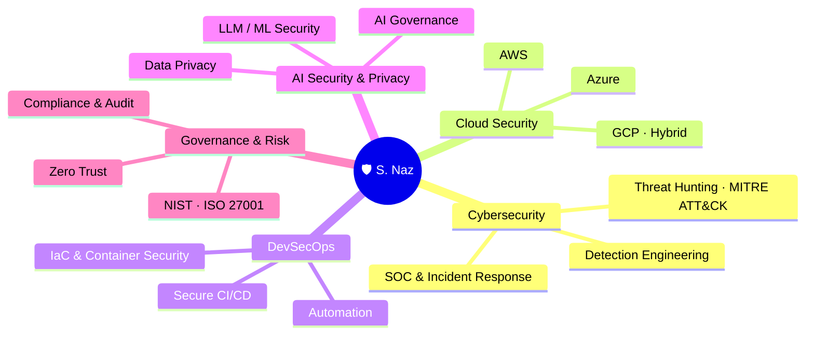

<!--
  ════════════════════════════════════════════════════════════════════════
  PROFILE README — repo: devsecforge/devsecforge
  Cybersecurity • Cloud • DevSecOps • AI Security & Privacy • Governance
  Experience reflects a real resume. Stats widgets pull LIVE data.
  ════════════════════════════════════════════════════════════════════════
-->

<!-- ░░░░░░░░░░░░░░░░░░░░ HERO BANNER ░░░░░░░░░░░░░░░░░░░░ -->
<a href="https://github.com/devsecforge">
  
</a>

<div align="center">

<!-- ELITE CREDENTIAL LINE -->


<!-- TYPING ANIMATION -->
[](https://www.linkedin.com/in/naz-cyber-solutions)

<a href="https://www.linkedin.com/in/naz-cyber-solutions"></a>
<a href="mailto:snaz2004@yahoo.com"></a>


</div>

---

## 🧠 Expertise at a Glance



---

## 👋 About Me

> **Multi-discipline Cybersecurity, Cloud & DevSecOps leader** with **15+ years** building secure, scalable, high-performance environments across **Azure, AWS, GCP, and hybrid** infrastructures. I blend hands-on technical mastery with strategic leadership — designing secure architectures, automating everything, driving **Zero Trust**, and uplifting engineering teams. Increasingly focused on the next frontier: **securing AI systems and protecting privacy** in a machine-learning world.

```yaml
name:        "S. Naz"
title:       "Cybersecurity · Cloud · DevSecOps Leader | AI Security & Privacy"
experience:  "15+ years across security, cloud, DevOps, networking & systems"
education:   "MSc, Information Technology (MSIT)"
focus:       ["Cloud Security", "DevSecOps", "AI Security & Privacy", "SOC & IR", "Zero Trust", "Risk & Governance"]
clouds:      ["Azure", "AWS", "GCP", "Hybrid / Multi-Cloud"]
open_to:     ["Security Leadership / SOC", "Cloud Security Architecture", "AI Security", "vCISO / Advisory", "Consulting"]
location:    "Ontario, Canada 🇨🇦"
motto:       "Shift left · Automate everything · Trust nothing · Secure the future."
```

---

## 🎯 Focus Areas

<table>
<tr>
<td width="25%" valign="top">

### 🛡️ Cybersecurity & SOC
- 24/7 SOC leadership
- Incident Response & Forensics
- Threat Hunting (ATT&CK)
- Detection Engineering
- SIEM / XDR / SOAR

</td>
<td width="25%" valign="top">

### ☁️ Cloud Security
- Azure · AWS · GCP
- Secure landing zones
- CSPM & posture mgmt
- Identity & Zero Trust
- Encryption & KMS

</td>
<td width="25%" valign="top">

### ⚙️ DevSecOps
- Secure CI/CD gates
- IaC & container security
- SAST · SCA · DAST
- Policy-as-code
- Security automation

</td>
<td width="25%" valign="top">

### 🤖 AI Security & Privacy
- LLM / ML security
- AI governance
- Data privacy & DLP
- Model risk & red-teaming
- Responsible AI

</td>
</tr>
</table>

---

## 🤖 AI Security & Privacy

> Securing AI is the defining security challenge of this decade. I focus on governing and hardening AI/ML systems and protecting the data that powers them — mapping emerging AI risk to the frameworks below.

<div align="center">


</div>

| Domain | What I cover |
|--------|--------------|
| **LLM / ML security** | Prompt injection, jailbreaks, insecure output handling, model/data poisoning, supply-chain (OWASP LLM Top 10, MITRE ATLAS) |
| **AI governance** | AI risk management & assurance aligned to **NIST AI RMF** and **ISO/IEC 42001**; model inventories, approval gates |
| **Data privacy** | Data classification, DLP, minimization, and privacy-by-design under **GDPR / PIPEDA**; securing training & inference data |
| **Secure AI in CI/CD** | Guardrails, secrets hygiene, and provenance for model & dependency pipelines |

---

## 🎓 Certifications

<div align="center">

**🔐 Security Leadership & Governance**


**☁️ Cloud — AWS & Azure**


**🪟 Microsoft & Foundations**


</div>

---

## 🧰 Technical Arsenal

**🛰️ SIEM · XDR · SOAR**
<br>


**☁️ Cloud Security — Azure · AWS · GCP**
<br>

&nbsp;


**🔑 Identity & Zero Trust**
<br>


**⚙️ DevSecOps · IaC · Automation**
<br>

&nbsp;


**🤖 AI Security · Data**
<br>


**📋 Governance & Frameworks**
<br>


---

## 🏛️ Security Architecture & Operations

> Reference material distilled from 15+ years leading SOC, cloud security, risk & governance.

<div align="center">

<a href="https://github.com/devsecforge/zero-trust-reference-architecture"></a>
<a href="https://github.com/devsecforge/soc-detection-engineering"></a>
<a href="https://github.com/devsecforge/cloud-security-baseline"></a>

</div>

- 🛡️ **[zero-trust-reference-architecture](https://github.com/devsecforge/zero-trust-reference-architecture)** — NIST 800-207 principles, maturity model, CIS/ISO control mappings, Azure/AWS enforcement examples.
- 🎯 **[soc-detection-engineering](https://github.com/devsecforge/soc-detection-engineering)** — Sentinel KQL + Splunk detections mapped to MITRE ATT&CK, plus NIST 800-61 IR playbooks.
- ☁️ **[cloud-security-baseline](https://github.com/devsecforge/cloud-security-baseline)** — Azure Policy + AWS Terraform guardrails mapped to CIS / NIST CSF, with a CSPM operating model.

---

## 🧪 Hands-On Labs (building in public)

> Reference implementations I build to stay hands-on with modern DevSecOps tooling — each with working code, CI, docs, and a threat model.

<div align="center">

<a href="https://github.com/devsecforge/security-operations-toolkit"></a>
<a href="https://github.com/devsecforge/kubernetes-security-lab"></a>
<a href="https://github.com/devsecforge/secure-terraform-aws"></a>

</div>

- 🛡️ **[security-operations-toolkit](https://github.com/devsecforge/security-operations-toolkit)** — CI/CD security gate: secret, SAST, SCA, IaC & container scanning.
- ☸️ **[kubernetes-security-lab](https://github.com/devsecforge/kubernetes-security-lab)** — 5-layer defense-in-depth: Pod Security Admission, RBAC, NetworkPolicy, Falco.
- 🔐 **[secure-terraform-aws](https://github.com/devsecforge/secure-terraform-aws)** — Secure-by-default AWS: hardened S3/KMS, least-privilege IAM, tfsec + checkov.

---

## ✍️ Writing & Thought Leadership

> I share what I learn — practical security, cloud, and AI-governance writing for engineers and leaders.

- 🔐 **Zero Trust in practice** — turning NIST 800-207 into Conditional Access & least-privilege that actually ship
- 🎯 **Detection engineering** — building high-fidelity Sentinel/Splunk rules mapped to MITRE ATT&CK
- 🤖 **Securing AI** — OWASP LLM Top 10, NIST AI RMF & ISO 42001, and privacy-by-design for ML pipelines
- ☁️ **Cloud security baselines** — policy-as-code guardrails for Azure & AWS at enterprise scale

<sub>📝 <b>First articles coming soon.</b> Follow on <a href="https://www.linkedin.com/in/naz-cyber-solutions">LinkedIn</a> — this section will link live posts as they publish.</sub>

---

## 📊 GitHub Activity

<div align="center">


</div>

---

## 🤝 Let's Connect

<div align="center">

Open to **security leadership · cloud security architecture · AI security · vCISO / advisory · consulting**.

<a href="https://www.linkedin.com/in/naz-cyber-solutions"></a>
<a href="mailto:snaz2004@yahoo.com"></a>

</div>


