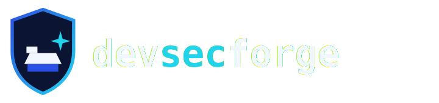

  

# devsecforge — Brand Guide

The visual system for the **devsecforge** personal brand. Keep it consistent everywhere — GitHub,
LinkedIn, slides, docs — so every touchpoint reads as one identity.

---

## 🎨 Color Palette

| Role | Name | Hex | Use |
|------|------|-----|-----|
| ■ Primary | **Royal Blue** | `#2B50E4` | Primary brand color, accents, links, key UI |
| ■ Accent | **Electric Cyan** | `#22D3EE` | Highlights, the "sec" in the wordmark, sparks |
| ■ Surface (dark) | **Deep Navy** | `#0B1533` | Dark backgrounds, cards, the shield fill |
| ■ Background | **Midnight** | `#070C1C` | Deepest background |
| ■ Text (on dark) | **Off-White** | `#F2F7FF` | Body text and wordmark on dark |
| ■ Muted | **Slate** | `#8AA0C6` | Secondary text, captions |

**Signature gradient:** Royal Blue `#2B50E4` → Electric Cyan `#22D3EE` (top-left → bottom-right).
Use it on the shield outline, dividers, and banner accents — sparingly, for pop.

---

## 🔷 Logo

**Concept:** a **shield** (security) forging an **anvil + spark** (the "forge" in devsecforge).

| File | Use |
|------|-----|
| [`icon.svg`](icon.svg) | Icon-only mark — app tiles, inline |
| [`avatar.svg`](avatar.svg) | Circular mark — GitHub/LinkedIn avatar *(export to PNG to upload)* |
| [`logo-dark.svg`](logo-dark.svg) | Full lockup for **dark** backgrounds |
| [`logo-light.svg`](logo-light.svg) | Full lockup for **light** backgrounds |
| [`wordmark.svg`](wordmark.svg) | Text-only wordmark |
| [`banner.svg`](banner.svg) | Profile / social hero banner |

### Clear space & size
- Keep clear space around the logo equal to the height of the shield's spark.
- Minimum icon size: **24px** (mark stays legible; below that use a solid-fill variant).

### Do ✅
- Use the gradient shield on dark; the solid royal-blue shield on light.
- Keep the wordmark lowercase, monospace, with **sec** in the accent color.
- Maintain the palette across all assets.

### Don't ❌
- Don't recolor the wordmark outside the palette.
- Don't stretch, rotate, or add drop shadows/outlines.
- Don't place the dark logo on a busy or low-contrast background.

---

## 🔤 Typography
- **Wordmark / code:** monospace — `JetBrains Mono`, `Fira Code`, `Consolas` (fallback `monospace`).
- **Headings/body:** clean sans — `Inter`, `Segoe UI`, system UI.
- Wordmark is always **lowercase** and **bold (800)**.

---

## 🗣️ Voice
Confident, precise, honest. Security-leader tone: outcomes over hype, evidence over adjectives.
Tagline: **“Secure by design. Secure the future.”**

---

© 2026 devsecforge (S. Naz). Logo & assets MIT-licensed within this repository.
